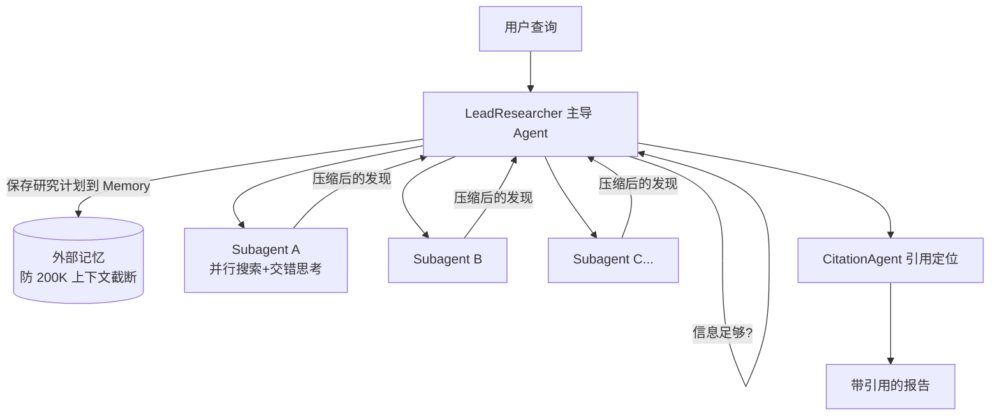

> 转型 AI Agent 开发的第一篇。动手写代码之前，先把三篇最重要的文献读完并消化掉：
>
> 1. [Building Effective Agents — Anthropic, 2024-12](https://www.anthropic.com/research/building-effective-agents)
> 2. [A Practical Guide to Building Agents — OpenAI](https://cdn.openai.com/business-guides-and-resources/a-practical-guide-to-building-agents.pdf)
> 3. [How We Built Our Multi-Agent Research System — Anthropic, 2025-06](https://www.anthropic.com/engineering/built-multi-agent-research-system)
>
> 以下是读完的真实体会，不是摘要搬运。

## 一、Building Effective Agents（Anthropic）

### 核心观点

这篇文章最重要的不是那些模式图，而是一句话：**能用简单方案就别上复杂方案**。Anthropic 把所有东西统称 agentic system，但严格区分了两类：

- **Workflow**：LLM 和工具走预定义的代码路径，模型只填充环节
- **Agent**：模型自己决定流程和工具使用，代码只提供循环和护栏

然后给出一个复杂度阶梯：augmented LLM（基础积木）→ prompt chaining → routing → parallelization → orchestrator-workers → evaluator-optimizer → 自主 agent。每升一级，都是用延迟和成本换灵活性。

### 最触动我的一点

**Agent 的实现往往非常简单**——"就是 LLM 根据环境反馈在循环里用工具"。真正难的是工具设计。附录 2 提出了 ACI（Agent-Computer Interface）的概念：给工具设计接口要像给人类设计 HCI 一样投入。他们做 SWE-bench 时，**优化工具的时间比优化 prompt 还多**——比如把相对路径强制改成绝对路径，模型就再也没犯过错。

这戳中了我这个后端工程师的舒适区：API 设计、接口文档、参数防呆（他们甚至用了 Poka-yoke 这个制造业术语），这些恰恰是后端的老本行，而不是新知识。

### 值得商榷的地方

文章对框架的态度很微妙：一边说"最成功的实现都没用复杂框架"，一边自家又推出了 Claude Agent SDK。合理解读是：他们反的是**不理解底层抽象的框架依赖**，不是框架本身。对我的启示很实际——先手写循环、再用框架，这个顺序刚好对应"确保你理解框架底下是什么"。

另一个存疑点：模式图是 2024 年底写的，文首自己也承认"工具生态已经变化"。但模式本身没有过时——这不是巧合，因为这些模式本质上就是后端的编排模式（routing 就是网关路由，parallelization 就是扇出聚合，orchestrator-workers 就是微服务的 saga 编排）。**AI Agent 没有发明新的分布式问题，只是把执行者从确定性代码换成了概率性模型。**

## 二、A Practical Guide to Building Agents（OpenAI）

### 核心观点

定义更窄也更实用："Agent 是**独立替你完成任务的系统**"，并给了判断标准——普通 LLM 应用（chatbot、分类器）不控制工作流执行，所以不是 agent。

选型三步法值得记住：**先用最强模型建立性能基线 → 达到准确率目标 → 再逐步换小模型优化成本延迟**。反过来做（先小模型再调优）会过早封顶。

### 和第一篇的分歧

最有价值的是两家的编排哲学差异：

- OpenAI 推 **manager 模式**（子 agent 作为 manager 的工具）和 **decentralized 模式**（agent 之间 handoff 平权转移）
- 更关键的是那句"maximize a single agent's capabilities first"：拆分多 agent 的信号是**prompt 里 if-else 太多**或**工具语义重叠**，而不是任务看起来复杂
- OpenAI 明确批评了声明式图框架（预定义节点和边）在动态工作流下的笨重，主张 code-first

把它和第一篇合起来看，共识非常清晰：**单一 agent + 好工具的覆盖范围远超多数人的想象，Multi-Agent 是最后手段而不是默认架构。** 这直接修正了我最初"Agent 开发 = Multi-Agent 开发"的想象——应该先把单 agent 的工具循环玩透。

OpenAI 这篇的另一半篇幅是 **Guardrails**，分类学很实用：relevance / safety / PII / moderation / 工具风险分级（低中高，高危操作暂停或转人工）。"乐观执行 + 触发即熔断"的实现思路和后端的断路器同构。

## 三、How We Built Our Multi-Agent Research System（Anthropic）

### 架构要点

三个设计细节很见功力：

1. **Search 的本质是压缩**——subagent 各自持有独立上下文窗口并行探索，把海量原始信息压缩成关键 token 再回传主 agent，这是 multi-agent 的真正价值：横向扩展 token 容量
2. **计划先落盘到 Memory**：上下文超过 200K 会被截断，先持久化再行动，防止"失忆"
3. **子 agent 产出直接写文件系统**，只回传轻量引用——避免多级转手导致的信息衰减（他们称之为"传话游戏"问题）

### 代价与取舍

数据说话：multi-agent 性能比单 agent 高 90.2%，但 **token 消耗是普通 chat 的 15 倍**（单 agent 是 4 倍）。他们明确说了不适用场景：需要所有 agent 共享同一上下文的任务（比如大多数编码任务），以及实时协调依赖强的任务。

"多 agent 的本质是花足够多的 token"——分析显示 token 用量解释了 80% 的性能方差。这句话既是洞见也是警告：**性能提升有相当部分是买来的，不是架构白送的。** 做成本敏感的业务 Agent 时要清醒。

### 评测方法论

这部分直接回答了我"评测怎么做"的疑问：

- **20 个测试用例就够起步**，别等凑齐几百个——早期改动影响巨大（一次 prompt 调整可能 30%→80%），小样本完全能看出来
- **LLM-as-judge 用单个 prompt 输出 0.0-1.0 分**，比多个 judge 更稳定、更贴近人类判断；评分维度：事实准确性、引用准确性、完整性、来源质量、工具效率
- **人工测试专抓自动化漏掉的**：他们靠人工发现 agent 总是引用 SEO 内容农场而非学术 PDF，然后靠 prompt 加来源质量启发式修复
- **终态评测为主，但不是"只看终态"**：agent 会改状态、路径不确定，所以正确性要验证"最终状态对不对"，容忍路径差异；复杂工作流在关键节点拆检查点断言中间状态。但过程并非不管——安全性靠执行时的确定性护栏（权限、高危操作人工审批），效率（工具调用次数、token 消耗）作为评分维度进入评测，而不是通过/失败的判据

### 生产可靠性

三点对后端工程师是熟悉的味道：错误会**复合放大**所以要做**断点续跑**（不能从头重试）；调试靠**全链路 trace + 决策模式监控**（不看对话内容，看交互结构）；部署用 **rainbow deployment**——新旧版本同时在线慢慢切流量，因为 agent 是长时状态机，不能一刀切重启。

## 四、综合心得

三篇读完，认识有三个修正：

**1. 复杂度阶梯是主线，Multi-Agent 只是顶楼。** 我原以为 Agent 开发的重点是 Multi-Agent 编排，实际上三家一致认为单 agent + 好工具覆盖 80% 场景。学框架之前应该先把单 agent 的 ReAct 循环跑透，遇到"prompt 里 if-else 爆炸"再拆——顺序反了就会把 Multi-Agent 当默认架构滥用。

**2. 后端经验不是"转型包袱"，是主武器。** ACI 就是 API 设计；guardrails 就是断路器 + 风险分级；断点续跑就是状态机持久化；rainbow deployment 就是滚动发布；上下文截断就是内存管理。这些"新概念"在分布式系统里都有旧名字，用后端的直觉去学 Agent 是加速而不是降维。

**3. 评测要尽早动手，不用等"完善"。** 20 个用例 + LLM-as-judge 单 prompt 评分 + 人工抽查，这个最小组合在写完第一个 Agent 循环后就可以搭。

一个遗留疑问留给自己写代码时验证：文献里的工具设计和评测都基于 Claude/OpenAI 的模型能力，国产模型（DeepSeek/GLM/Qwen）在 tool calling 的可靠性、JSON 约束的服从性上是否同档？——这正好和接下来要做的内容相关。

## 五、下一步

用 Go `net/http` 手撕 LLM 调用协议，裸写 SSE 流式解析，会对接主流模型各跑一遍。目标不是写出能用的代码，而是把"一次 LLM 调用"的全部细节变成肌肉记忆。
